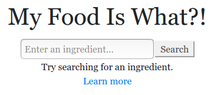

Have you ever looked at the nutrition label on your food packaging only to find that you don't recognize half of the ingredients? Don't worry. A query to My Food Is What?! will quickly illuminate the situation. Is it paleo-approved or was it chemically manufactured in an underground laboratory? No more scouring through a million blog posts to find the answer! 

My Food Is What?! is free (libre) and open source software under the [AGPL v3](LICENSE).
